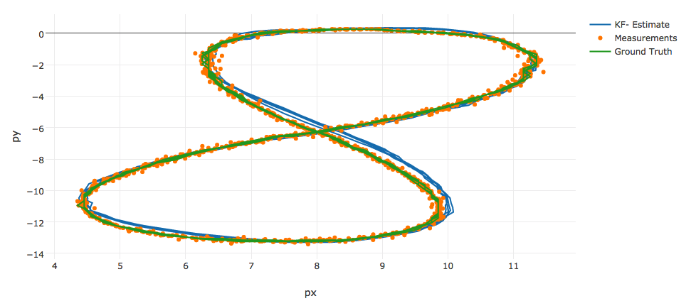
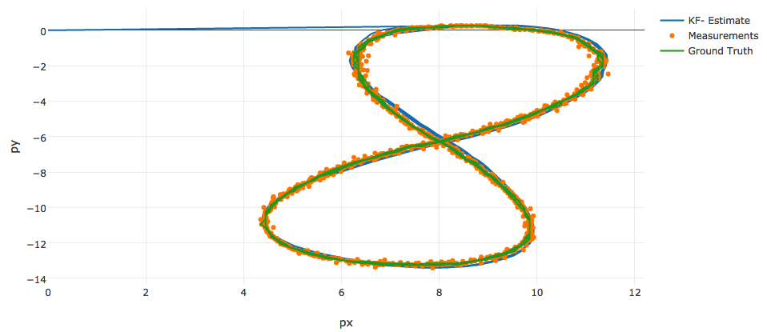
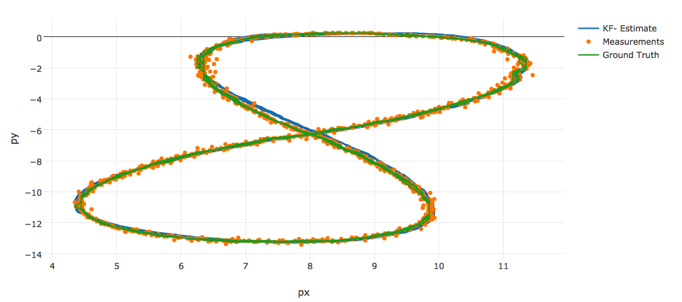
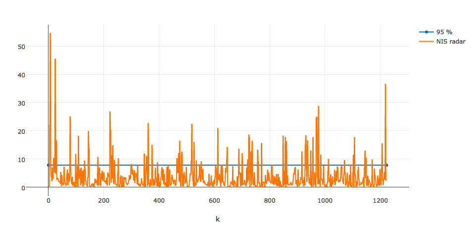

# Unscented Kalman Filter Project Starter Code
Self-Driving Car Engineer Nanodegree Program

---

## Dependencies

* cmake >= v3.5
* make >= v4.1
* gcc/g++ >= v5.4

## Basic Build Instructions

1. Clone this repo.
2. Make a build directory: `mkdir build && cd build`
3. Compile: `cmake .. && make`
4. Run it: `./UnscentedKF path/to/input.txt path/to/output.txt`. You can find
   some sample inputs in 'data/'.
    - eg. `./UnscentedKF ../data/sample-laser-radar-measurement-data-1.txt output.txt`

## Editor Settings

We've purposefully kept editor configuration files out of this repo in order to
keep it as simple and environment agnostic as possible. However, we recommend
using the following settings:

* indent using spaces
* set tab width to 2 spaces (keeps the matrices in source code aligned)

## Code Style

Please stick to [Google's C++ style guide](https://google.github.io/styleguide/cppguide.html) as much as possible.

## Generating Additional Data

This is optional!

If you'd like to generate your own radar and lidar data, see the
[utilities repo](https://github.com/udacity/CarND-Mercedes-SF-Utilities) for
Matlab scripts that can generate additional data.

## Project Instructions and Rubric

This information is only accessible by people who are already enrolled in Term 2
of CarND. If you are enrolled, see [the project page](https://classroom.udacity.com/nanodegrees/nd013/parts/40f38239-66b6-46ec-ae68-03afd8a601c8/modules/0949fca6-b379-42af-a919-ee50aa304e6a/lessons/c3eb3583-17b2-4d83-abf7-d852ae1b9fff/concepts/4d0420af-0527-4c9f-a5cd-56ee0fe4f09e)
for instructions and the project rubric.

## Results
Current parameter tuning gives the following RMSE accuracy between estimations and ground truth.
File 1: 
Accuracy - RMSE: 
px 0.0741202 
py 0.0841529 
vx 0.582077 
vy 0.587683 
 
File 2: 
Accuracy - RMSE: 
px 0.184262 
py 0.179197 
vx 0.222446 
vy 0.233886 

## Visualisations
Below are some images showing how the UKF can track the moving object using just the radar sensor data; lidar sensor data and combined sensor data:

Radar only                    |  Lidar only                   |  Combined
:----------------------------:|:-----------------------------:|:-------------------------
  |   |  
px: 0.164535, py: 0.210871    | px: 0.280238, py: 0.146671    | px: 0.0741202, py: 0.0841529

Note how much better the tracking is when we fuse the sensor data...

Normalised Innovation Squared (NIS) is a technique used to check the consistency of the UKF. It follows a Chi-squared distribution and we can plot the 95% interval. If allot more than 5% of our data points are above this line then it shows inconsistency in our results and we may need to tune our process noise measurement or it could highlight issues with out algorithm.

